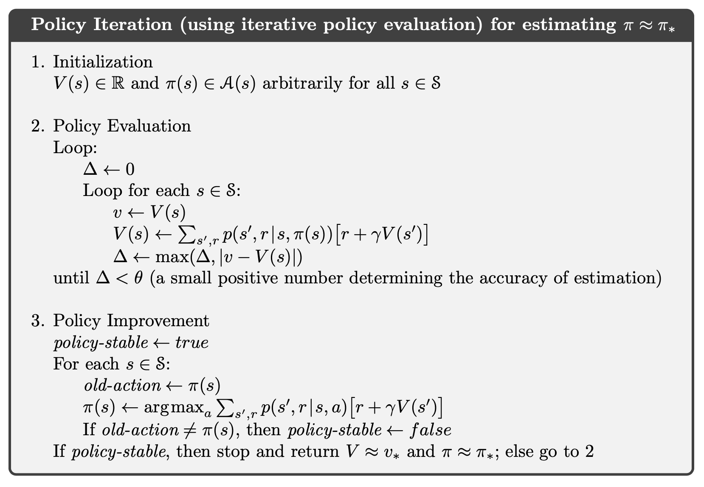
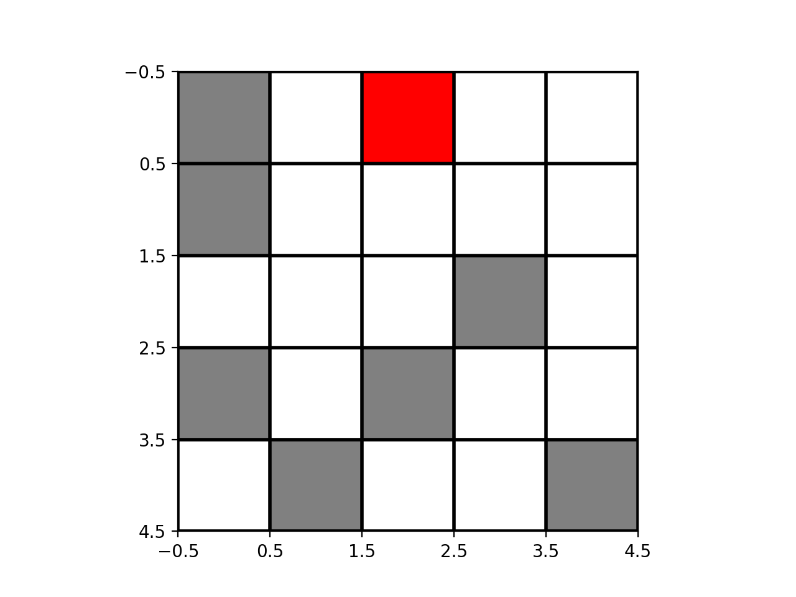
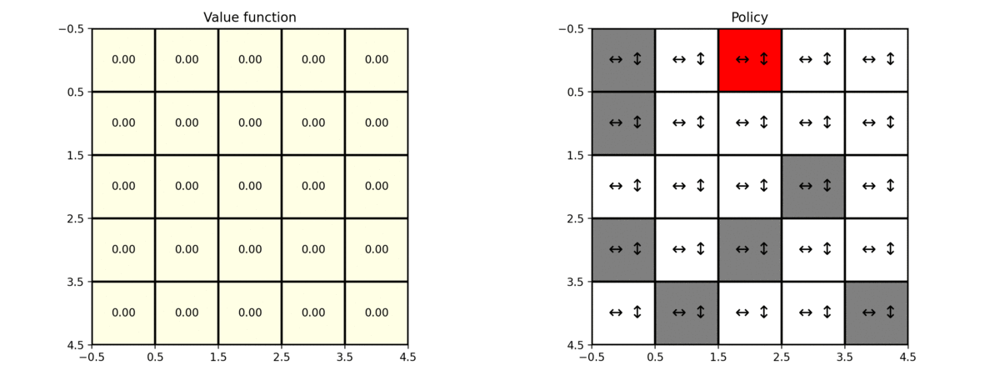

# Policy Iteration on GridWorld example

After taking the [Fundamentals of Reinforcement Learning](https://www.coursera.org/learn/fundamentals-of-reinforcement-learning) 
course on Coursera, I decided to implement the Policy Iteration algorithm to solve the GridWorld problem.


## Usage
To randomly generate a grid world instance and apply the policy iteration algorithm to find the best path to a terminal cell, you can run the `solve_maze.py` script using a set of arguments:
* `n`: width and height of the maze
* `p_barrier`: probability of a cell being a barrier
* `r_barrier`: reward of barrier cells
* `v0_val`: initial value for the value function
* `gamma`: discount rate parameter
* `theta`: threshold parameter that defines when the change in the value function is negligible
* `seed_nr`: seed number, for reproducible results

Below is an example of the usage of this script with a particular set of parameters:

```python solve_maze.py --n 5 --p_barrier 0.1 --r_barrier -5 --v0_val 0 --gamma 0.9 --theta 0.01 --seed_nr 123```


## Policy Iteration algorithm
The policy iteration algorithm consists of three steps:
1. *Initialization*: initialize the value function as well as the policy (randomly).

2. *Policy Evaluation*: uses the Bellman equation as an update rule to iteratively construct the value function.

3. *Policy Improvement*: chooses the policy that maximizes the value function of the original policy (greedy).

Below is the pseudocode for the Policy Iteration procedure, from [Reinforcement Learning: An Introduction](http://incompleteideas.net/book/RLbook2018.pdf).




## Code

We will use the policy iteration algorithm to solve the famous grid world problem. We have an  grid, that 
has cells of a given type:

* *terminal*: when the agent reaches that state, the task ends (episodic task). The value function for this state is 
always 0;
* *barrier*: the agent must avoid these type of cells when trying to reach the terminal state. These cells 
will be given a significantly smaller reward;  
* *normal*: cells that are neither terminal nor barrier.

Every cell will have a reward of -1, with the exception of barrier cells, that have a more negative reward (e.g. -5).
We will randomly build a grid of this type. Below is an example of such a grid using `n=5`, `p_barrier = 0.1` 
(probability of a cell being of type barrier), and `r_barrier = -5` (reward of barrier cells). The terminal cell is red, the barrier cells are gray, and the normal ones are white. 




The set of possible actions is composed by the 4 directions: left, up, right and down. Every time the agent makes a move
to outside the grid, it stays in the same position.

This problem can thus be formulated as a Markov Decision Process (MDP), where
* the set of *states* is composed by every cell of the grid;
* the set of actions is to go left, up, right or down (irrespectively of the current state of the agent);
* reward is -1 for every non-barrier cell, and a smaller value (e.g. -5) for barrier cells.


Starting with the equiprobable policy - the probability of the agent moving in every direction is 0.25 - and choosing 
 and , the policy iteration algorithm converges after 4 steps (a step is composed by 
running both the policy evaluation and policy improvement procedures). Below you can see the value function (left) and 
the policy (right) after each step of the algorithm.


